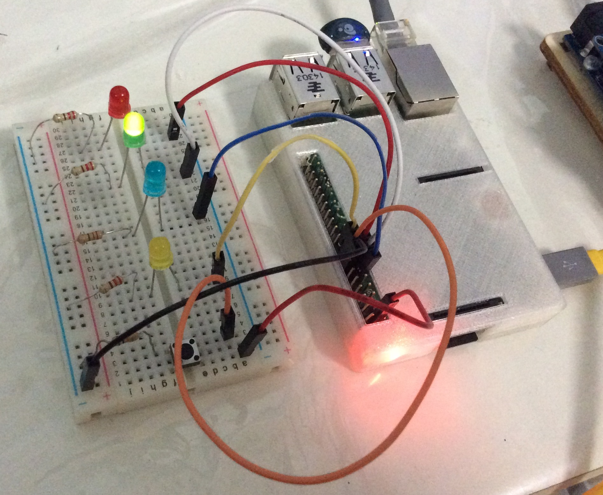
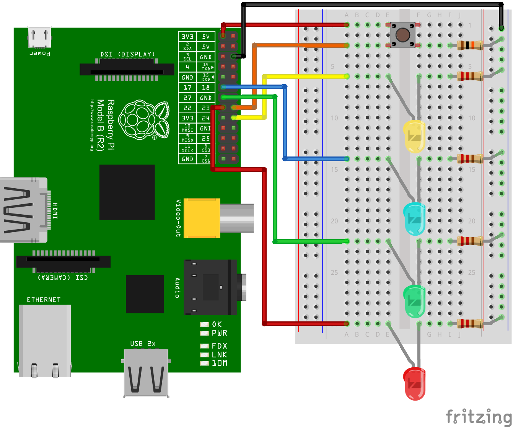

Intro to BLE (Raspberry Pi Peripheral)
=============

This Raspberry Pi is programmed to act as a Bluetooth Low Energy peripheral as part of my talk on the introduction to BLE.



##Parts used
1. Raspberry Pi 2 Model B (others will just as well)
2. IOGear GBU521 USB BLE (Dual-Mode) adapter, not required for Rpi 3
3. Red LED
4. Green LED
5. Blue LED
6. Yellow LED
7. 4x 220ohm resistors
8. Push Button
9. 10k ohm pull-down resistor



##Setup instructions

I personally prefer Arch Linux but I include instructions for Raspbian too. 

For Raspberry Pi 3, there are some issues with the serial UART and the solution may affect the Bluetooth portion as well. Consult the [gist for Arch Linux ARM I have written for more information](https://gist.github.com/yeokm1/d6c3ca927919c61257cd). 

For Raspbian on Rpi3, just add the `core_freq=250` to the bottom of the `/boot/config.txt` to get proper Serial debug is good enough.

Arch Linux ARM
```bash
#This is for Rpi 3 only if you have followed my gist. My gist will have installed a patched version of bluez.
pacman -Syu --needed python2 make gcc git bluez-utils bluez-libs nodejs npm

#Other Rpis will install bluez
pacman -Syu --needed python2 make gcc git bluez bluez-utils bluez-libs nodejs npm


git clone https://github.com/yeokm1/intro-to-ble.git
cd intro-to-ble/raspi_ble
npm install
#npm install may take a long time to run so be patient
```

Raspbian
```bash
sudo apt-get install pi-bluetooth bluez libbluetooth-dev libudev-dev git 

#Manually install latest nodejs as Raspbian's is severely out-of-date
wget https://nodejs.org/dist/v5.9.0/node-v5.9.0-linux-armv7l.tar.gz
tar -xvf node-v5.9.0-linux-armv7l.tar.gz
cd node-v5.9.0-linux-armv7l/
sudo cp -R * /usr/local/

git clone https://github.com/yeokm1/intro-to-ble.git
cd intro-to-ble/raspi_ble
npm install
```

##Start on boot

Arch Linux only

```bash
nano /etc/systemd/system/intro-to-ble.service

#Add the following lines to intro-to-ble.service till but not including #end
[Unit]
Description=To start intro-to-ble on startup

[Install]
WantedBy=multi-user.target

[Service]
Type=idle
RemainAfterExit=yes
ExecStart=/root/intro-to-ble/raspi_ble/intro_ble_startup.sh
#end

systemctl enable intro-to-ble.service
```

##Read-only file system

I recommend a read-only file system in case rapid restarts are necessary in a demo and you don't wish to corrupt the SD card. Consult my [gist for Arch Linux](https://gist.github.com/yeokm1/8b0ffc03e622ce011010).

##Run instructions

Both
```bash
cd intro-to-ble/raspi_ble
```

Arch Linux only
```bash
hciconfig hci0 up
node ble.js
```

Raspbian only
```bash
sudo node ble.js
```

##Software/Libraries used
1. Nodejs
2. [Bleno by sandeepmistry](https://github.com/sandeepmistry/bleno)
3. [onoff GPIO by fivdi](https://github.com/fivdi/onoff)
